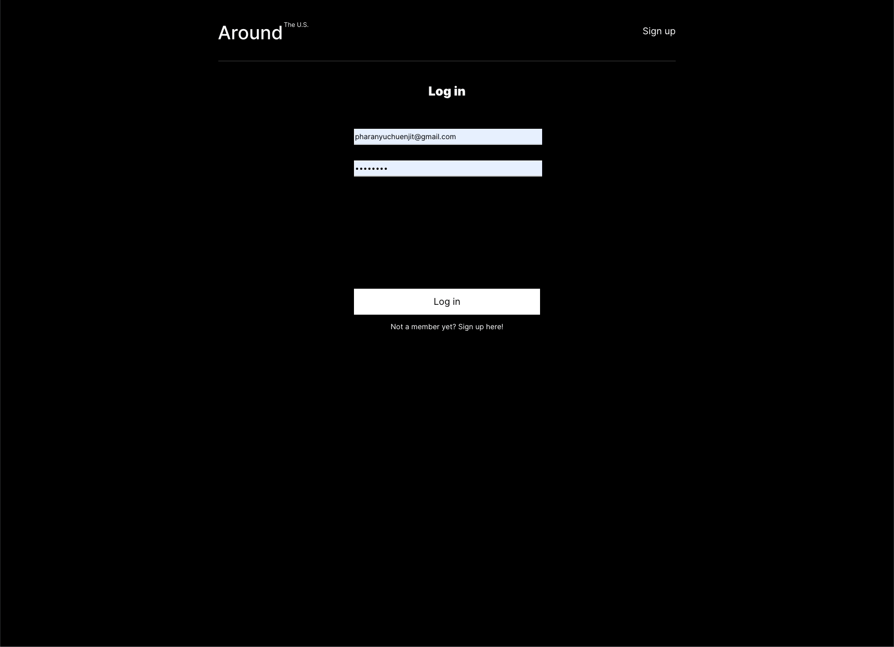
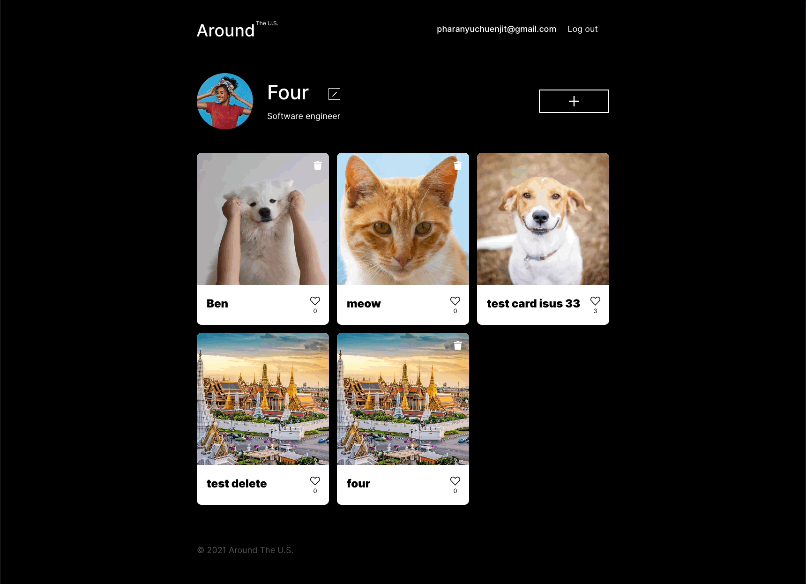
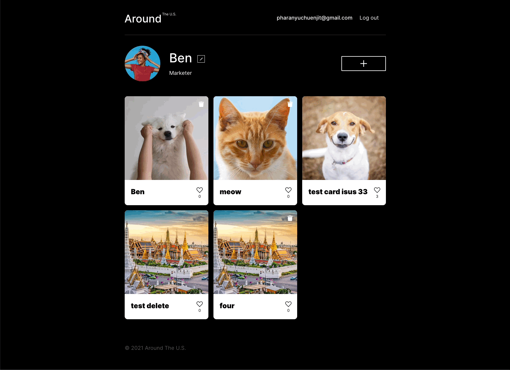
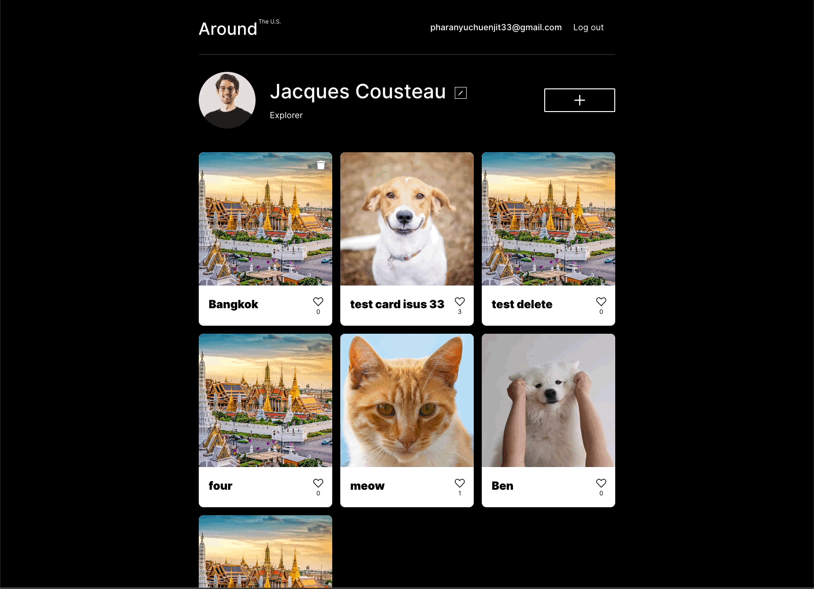

# react-around-api-full
The API of "Around the U.S." with authorization and registration handled by the back-end server.

This application develped by "MERN" stack is the full stack project. The purpose to of this project to understand how to developer 
web applcation with both side Fronted and Backend.

## Features
* User authorization (Login and register system)
* Allow user to edit their name, about and avatar
* User can create card and delete their own card.
* User can like and dislike to other card.
* User can still login when refresh the browser or exit the browser.(using LocalStorage and JWT)
* Responsive design 

### User Authorization 
Register

### Edit profile
Edit name and about

Edit avatar

### Delete card (Only card that you created)

### Like and dislike

### Popup

## Technology
### Frontend
* React 
* HTML/CSS

### Backend
* Node.js
* Express
* MongoDB
* Deploy on Google cloud

This repository contains the full API of "Around the U.S." project that features user authorization and user registration and handles cards and users. Please add to this readme:
* [https://around-pharanyu.students.nomoredomainssbs.ru](https://around-pharanyu.students.nomoredomainssbs.ru)
* [https://api.around-pharanyu.students.nomoredomainssbs.ru](https://api.around-pharanyu.students.nomoredomainssbs.ru)
